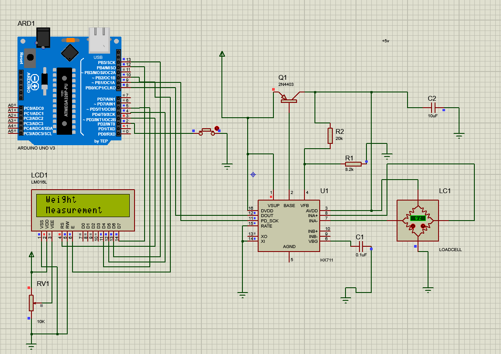

# Automated Weigh Counting System

A simple Arduino-based weigh counting system using an HX711 load cell amplifier and an I2C LCD. This README explains the project purpose, required hardware, calibration tips, and simple troubleshooting.

---

  

## Features

- Reads weight from a load cell through the HX711 ADC
- Displays the measured weight and a computed `nb` value on a 20x2 I2C LCD
- Trigger measurement via a push button (interrupt)
- Serial output for debugging and logging

---

## Hardware

- Arduino (Uno, Nano, or compatible)
- Load cell (e.g. 5kg, 10kg)
- HX711 amplifier (HX711 module)
- 20x2 I2C LCD (address 0x27)
- Push button
- Jumper wires and breadboard
- Power supply (USB or external)

---

## Libraries

This sketch requires the following Arduino libraries (install via the Arduino Library Manager or manually):

- `HX711_ADC`
- `LiquidCrystal_I2C`

Make sure they are installed before compiling.

---

## Calibration

The system uses a calibration factor that must be adjusted to obtain accurate weight readings:

1. Place a known weight on the load cell (for example, 1.00 kg).
2. Read the raw output printed to Serial Monitor when you press the button.
3. Adjust the calibration factor until the displayed value matches the known weight.

Typical workflow:

- Start with `1000.0` and change it up or down to scale the reading.
- When adjusting, change the calibration factor in the code setup.

---

## Usage

1. Connect the hardware and upload the sketch to your Arduino.
2. Open the Serial Monitor (baud 9600) to observe debug prints.
3. Press the push button to trigger a measurement — the LCD will update with the measured weight and `nb` value.

---

## Troubleshooting

- **LCD shows nothing**: Confirm I2C address (0x27). Use an I2C scanner sketch to find the address. Check wiring and power.
- **No weight reading / constant zeros**: Verify wiring between load cell and HX711. Check that initialization steps are correctly called.
- **Readings unstable or noisy**: Ensure the load cell is mounted firmly, remove vibrations, add averaging, or increase stabilization time.
- **Large negative `nb` values**: Ensure calibration and scaling are correct for your module.
# Automated Weigh Counting System
